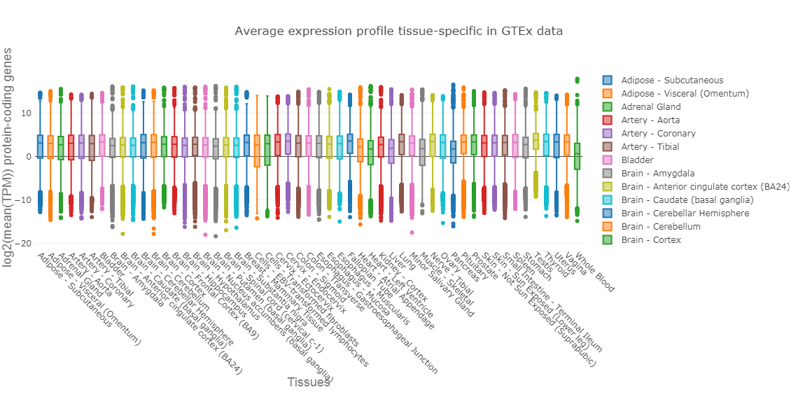
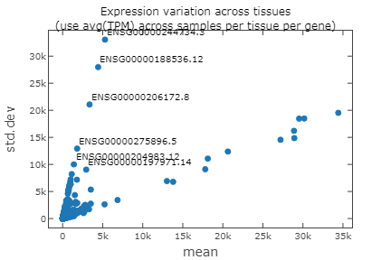
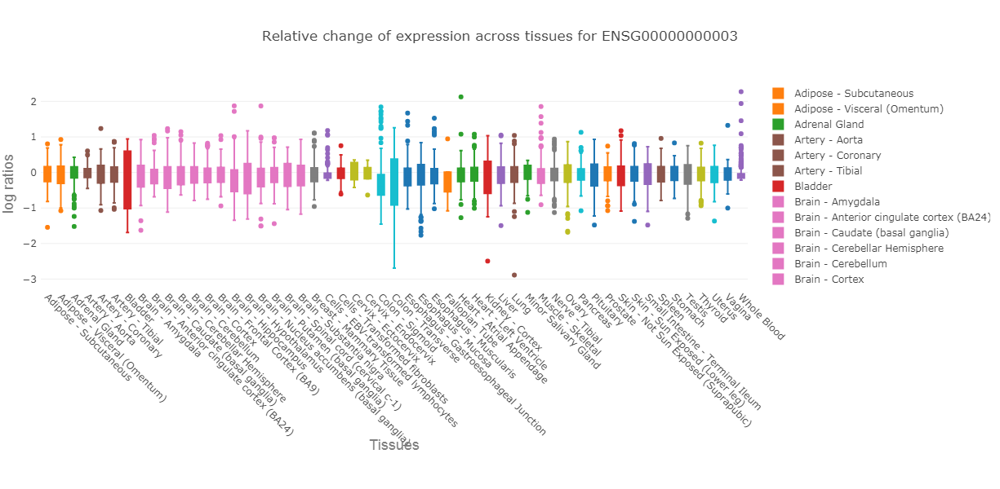
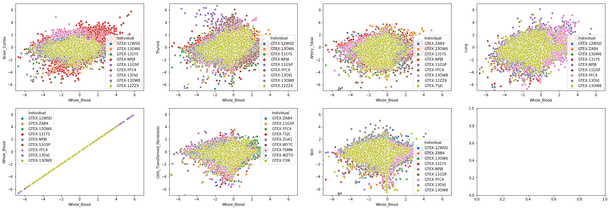
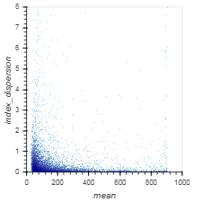

### Goal
Compute baseline model - tissue mean across individuals using the TPM values.

### TODO
1. Compute baseline model
2. Check baseline model
    - how are the avg(TPM) values per gene per tissue
    - identify set of genes for which the avg(TMP) not/highly varie across tissues
3. TPM to log ratios (relative expression with respect to the mean within one tissue)
    - plot brain against blood per individual
4. Compute metadata
    - dispersion index per gene (better distinguish between genes which more likely to be tissue specific / genes which are expressed in all tissues)
    - top tissues (most samples available)
    - top individuals (most tissues available)

### Conclusions
1. Compute baseline model
    - The model can be found under `/s/projects/rep/processed/models/baseline/baseline_mean_tissues.pkl`
2. Check baseline model
    - Gene expression distribution is similar for all tissues
    - Mito Genes tend to be strongly expression over all tissues
    - Top tissue - specific genes, with a very strong signal:
        + ENSG00000188536.12 (HBA2, enhanced in bone marrow - whole blood)
        + ENSG00000197971.14 (MBP, enhanced in brain - spinal cord)
        + ENSG00000204983.12 (PRSS1, enhanced in pancreas)
        + ENSG00000206172.8 (HBA1, enhanced in bone marrow - whole blood)
        + ENSG00000244734.3 (HBB, enhanced in bone marrow - whole blood)
        + ENSG00000275896.5 (PRSS2, enhanced in pancreas)
        + ENSG00000259384.6 (GH1, pituitary gland)
3. TPM to log ratios 
    - The log ratios values can be found under `/s/projects/rep/processed/gtex/recount/recount_gtex_logratios.h5ad`
    - Top 10 Tissues:
    
    Muscle - Skeletal                  435<br/>
    Whole Blood                        429<br/>
    Skin - Sun Exposed (Lower leg)     371<br/>
    Adipose - Subcutaneous             358<br/>
    Lung                               354<br/>
    Artery - Tibial                    343<br/>
    Thyroid                            340<br/>
    Nerve - Tibial                     310<br/>
    Esophagus - Mucosa                 309<br/>
    Cells - Transformed fibroblasts    290<br/>
4. Compute metadata
    - <font color="red">Still missing</font>


```python
import os
import pandas as pd
import numpy as np

import plotly
import plotly.plotly as py
from plotly.graph_objs import graph_objs
import plotly.tools as tls
import matplotlib.pyplot as plt

# set credentials
plotly.tools.set_credentials_file(username='gium', api_key='nUFs5UnmuBR3pEbGIMj8')

import rep.preprocessing_new as p
import rep.plot as po

import warnings; warnings.simplefilter('ignore')

%matplotlib inline

```

### 1. Compute baseline model


```python
def compute_baseline(repobj):
    """Compute average for each tissue across samples
    
    Args:
        repobj (:obj:RepAnnData): summarized experiment genes x samples
    
    Returns:
        DataFrame containing x_ij - mean expression of gene j in tissue i.
    """
    tissues = sorted(repobj.samples['Tissue'].drop_duplicates().tolist())
    Y_mean_tissue = np.zeros((len(tissues),len(repobj.genes_names)))
    
    for t in tissues:
        slice_bytissue = repobj[repobj.samples['Tissue'] == t]    
        mean_value = np.mean(slice_bytissue.X,axis=0)
        Y_mean_tissue[tissues.index(t),:] = mean_value
    
    out = pd.DataFrame(data = Y_mean_tissue, columns = repobj.genes_names, index = tissues)
    return out

```


```python
path = os.path.join(os.readlink(os.path.join("..","..","data")),"processed")
gtex = p.RepAnnData.read_h5ad(os.path.join(path, "gtex","recount","recount_gtex_norm_tmp.h5ad"))
baseline_prediction = compute_baseline(gtex)
baseline_prediction.to_pickle(os.path.join(path,"models","baseline","baseline_mean_tissues_new.pkl"))
```

### 2. Check baseline model
- how are the avg(TPM) values per gene per tissue


```python
# how are the avg(TPM) values per gene per tissue
# generate data
data = []
tissues = sorted(baseline_prediction.index.tolist())
tmp = baseline_prediction.iloc[:,:]
for t in tissues:
    data.append(graph_objs.Box(y=np.log2(tmp.loc[t,:]), name=t))
```


```python
# plot figure
fig = graph_objs.Figure(data=data, layout=po.get_layout(_xlab = "Tissues",
                                                    _ylab = "log2(mean(TPM)) protein-coding genes",
                                                    _title = "Average expression profile tissue-specific in GTEx data"))
py.iplot(fig, filename='expression_per_tissue')
```


<iframe id="igraph" scrolling="no" style="border:none;" seamless="seamless" src="https://plot.ly/~gium/62.embed" height="600px" width="100%"></iframe>


```python
po.show_img("3_baseline_mean_tissue_gtex_files/avg_tmp_pcgenes_gtex.png")
```





- identify set of genes for which the avg(TPM) not/highly varie across tissues


```python
stats=pd.DataFrame()
stats["mean"]=baseline_prediction.mean(axis=0)
stats["Std.Dev"]=baseline_prediction.std(axis=0)
stats["max"]=baseline_prediction.max(axis=0)
stats["min"]=baseline_prediction.min(axis=0)
stats["Var"]=baseline_prediction.var(axis=0)
```


```python
stats["median"] = np.zeros(stats["Var"].shape[0])
for i in range(stats["Var"].shape[0]):
    stats["median"][i] = np.median(baseline_prediction.iloc[:,i])
```


```python
fig = plt.figure()
ax = fig.add_subplot(111)

x = stats["mean"].tolist()
y = stats["Std.Dev"].tolist()

ax.scatter(x,y)
ax.set_title('Expression variation across tissues\n(use avg(TPM) across samples per tissue per gene)')

for i, txt in enumerate(stats.index.tolist()):
    if x[i] <= 6000 and y[i]>8000:
        ax.annotate(txt, (x[i], y[i]))
        print(txt)

plotly_fig = tls.mpl_to_plotly( fig )
plotly_fig['layout']['showlegend'] = False
plotly_fig['layout']['xaxis']['title'] = 'mean'
plotly_fig['layout']['yaxis']['title'] = 'std.dev'
py.iplot(plotly_fig,filename='expression_per_tissue')
```

    ENSG00000188536.12
    ENSG00000197971.14
    ENSG00000204983.12
    ENSG00000206172.8
    ENSG00000244734.3
    ENSG00000259384.6
    ENSG00000275896.5


<iframe id="igraph" scrolling="no" style="border:none;" seamless="seamless" src="https://plot.ly/~gium/62.embed" height="288px" width="432px"></iframe>


```python
po.show_img("3_baseline_mean_tissue_gtex_files/variation_expression_acrosstissue.png")
```





### 3. TPM to log ratios


```python
def to_log_ratio(repobj, baseline_prediction):
    
    x = np.zeros((repobj.X.shape[1],repobj.X.shape[0]))

    for i, sample in enumerate(repobj.samples_names):
        tissue = repobj.samples.loc[sample,'Tissue']
        x[:,i] = np.log2(repobj[sample].X + 1 ) - np.log2(baseline_prediction.loc[tissue,:] + 1)
    
    return x.transpose()
```


```python
gtex = p.RepAnnData.read_h5ad(os.path.join(path, "gtex","recount","recount_gtex_norm_tmp.h5ad"))
x_expression_ratios = to_log_ratio(gtex, baseline_prediction)
gtex.X = x_expression_ratios
file = os.path.join(os.readlink(os.path.join("..","..","data")),"processed","gtex","recount","recount_gtex_logratios.h5ad")
gtex.save(file)
```


    '/s/project/rep/processed/gtex/recount/recount_gtex_logratios.h5ad'


```python
import matplotlib.pyplot as plt
import seaborn as sns

# list of tissues and parent tissues
tissues = sorted(list(set(gtex.samples['Tissue'].tolist())))
parent_tissue = sorted(list(set(gtex.samples['Parent_Tissue'].tolist())))

# generate colors
palette = sns.color_palette(None, len(parent_tissue)).as_hex()
```


```python
# generate data
data = []

# PTEN "ENSG00000171862.9"
# TSPAN6 "ENSG00000000003.14"
# OPALIN - brain enriched ENSG00000197430.10
# TTN - muscles enriched ENSG00000155657.25 - hier they cut at 1200 (removed an outlier with TPM=8000 ish)
gene = 'ENSG00000000003.14'
gtex_tmp = gtex[:,gene]
for t in tissues:
    pt = list(set(gtex_tmp[gtex_tmp.obs['Tissue'] == t].obs['Parent_Tissue'].tolist()))[0]
    color_pt = palette[parent_tissue.index(pt)]
    data.append(graph_objs.Box(y=gtex_tmp[gtex_tmp.obs['Tissue'] == t].X, 
                                name=t,
                                fillcolor= color_pt,
                                marker = dict(color = color_pt)))

```


```python
# plot figure
fig = graph_objs.Figure(data=data, layout=po.get_layout(_xlab = "Tissues",
                                                        _ylab = "log ratios",
                                                        _title = "Relative change of expression across tissues for ENSG00000000003"))
py.iplot(fig, filename='expression_per_tissue')
```

    /opt/modules/i12g/anaconda/3-5.0.1/envs/rep/lib/python3.6/site-packages/IPython/core/display.py:689: UserWarning:
    
    Consider using IPython.display.IFrame instead
    


<iframe id="igraph" scrolling="no" style="border:none;" seamless="seamless" src="https://plot.ly/~gium/62.embed" height="600px" width="100%"></iframe>


```python
po.show_img('3_baseline_mean_tissue_gtex_files/logratios_ENSG00000000003.png')
```

    /opt/modules/i12g/anaconda/3-5.0.1/envs/rep/lib/python3.6/site-packages/IPython/core/display.py:689: UserWarning:
    
    Consider using IPython.display.IFrame instead
    





- Plot brain against blood per individual


```python
file = os.path.join(os.readlink(os.path.join("..","..","data")),"processed","gtex","recount","recount_gtex_logratios.h5ad")
gtex = p.RepAnnData.read_h5ad(file)
```


```python
tissues_per_indiv = gtex.samples[['Individual','Tissue']].drop_duplicates().groupby(['Individual'], sort=True).size().sort_values(ascending=False)
print(tissues_per_indiv[:10])
print(tissues_per_indiv[:10].index.tolist())
```

    Individual
    GTEX-12WSD    36
    GTEX-ZAB4     35
    GTEX-13OW6    34
    GTEX-131YS    32
    GTEX-NPJ8     32
    GTEX-11GSP    32
    GTEX-YFC4     31
    GTEX-13OVJ    31
    GTEX-13OW8    31
    GTEX-12ZZX    30
    dtype: int64
    ['GTEX-12WSD', 'GTEX-ZAB4', 'GTEX-13OW6', 'GTEX-131YS', 'GTEX-NPJ8', 'GTEX-11GSP', 'GTEX-YFC4', 'GTEX-13OVJ', 'GTEX-13OW8', 'GTEX-12ZZX']


```python
import seaborn as sns
from matplotlib import rcParams

def tissue_tissue(x_tissue, y_tissue, n_top, x_label, y_label, gtex, plot_axes = None):
    
    palette = sns.color_palette(None, n_top).as_hex()

    n = n_top - 1 
    # scatterplot values blood against brain 
    x = np.array([])
    y = np.array([])
    s = np.array([])
    
    genes = gtex.X.shape[1]

    count = 0
    for indiv in tissues_per_indiv.index.tolist():
        if count == n:
            break
        indiv_samples = gtex[gtex.samples['Individual'] == indiv]
        # list of tissues for individual
        available_tissues = indiv_samples.obs[indiv_samples.obs['Tissue'].isin([x_tissue,y_tissue])]['Tissue'].drop_duplicates().tolist()
        if x_tissue != y_tissue and len(available_tissues) == 2 or \
            x_tissue == y_tissue and len(available_tissues) == 1:
            count += 1
            
            # take first sample for the individual which matches the tissue
            y_test_tissue =  indiv_samples[indiv_samples.obs['Tissue'] == y_tissue].X.reshape(genes, -1)[:, 0]
            x_test_tissue =  indiv_samples[indiv_samples.obs['Tissue'] == x_tissue].X.reshape(genes, -1)[:, 0]            

            s_color = [palette[count]] * len(x_test_tissue)
            s_color = [indiv] * len(x_test_tissue)
            
            x = np.append(x, x_test_tissue, axis=0)
            y = np.append(y, y_test_tissue, axis=0)
            s = np.append(s, s_color, axis=0)
            
           
    data = pd.DataFrame(data = {x_label:x, y_label:y, 'Individual':s})
    ax = sns.scatterplot(x=x_label, y=y_label, hue="Individual", data=data, ax = plot_axes)
    ax.set(ylim=(-7, 7), xlim=(-7,7))
```


```python
f, axes = plt.subplots(2, 4,figsize=(30,10))
tissue_tissue("Whole Blood", "Brain - Cortex", 10, "Whole_Blood", "Brain_Cortex", gtex, plot_axes = axes[0][0])
tissue_tissue("Whole Blood", "Thyroid", 10, "Whole_Blood", "Thyroid", gtex, plot_axes = axes[0][1])
tissue_tissue("Whole Blood", "Artery - Tibial", 10, "Whole_Blood", "Artery_Tibial", gtex, plot_axes = axes[0][2])
tissue_tissue("Whole Blood", "Lung", 10, "Whole_Blood", "Lung", gtex, plot_axes = axes[0][3])
tissue_tissue("Whole Blood", "Whole Blood", 10, "Whole_Blood", "Whole_Blood", gtex, plot_axes = axes[1][0])
tissue_tissue("Whole Blood", "Cells - Transformed fibroblasts", 10, "Whole_Blood", "Cells_Transformed_fibroblasts", gtex, plot_axes = axes[1][1])
tissue_tissue("Whole Blood", "Skin - Sun Exposed (Lower leg)", 10, "Whole_Blood", "Skin", gtex, plot_axes = axes[1][2])
```





### 4. Compute metadata
We need a summary of the experiments by individuals, tissues and genes.

#### 4.1. Dispersion index
For genes, we computed already the avg(TPM) per tissue for each of the 53 tissues.<br/>
In order to identify tissue specific genes, we compute the index of dispersion (std.dev/mean), where std.dev and mean are the parameters for the avg(TPM) distribution across tissues.<br/>
- index_dispersion >1, gene is more likely to be tissue specific
- index_dispersion <1, gene has a low variance across different tissues == expressed in all tissues (we choose those genes with mean > 400)


```python
# index of dispersion
stats['index_dispersion'] = stats['Std.Dev']/stats['mean']
```


```python
import datashader as ds, pandas as pd
import datashader.transfer_functions as tf
import holoviews as hv
import holoviews.operation.datashader as hd

hd.shade.cmap=["lightblue", "darkblue"]
hv.extension("bokeh", "matplotlib")

# %%output backend="matplotlib"
%matplotlib inline

cvs = ds.Canvas(plot_width=300, plot_height=300,x_range=(0,8), y_range=(0,1000), x_axis_type='linear', y_axis_type='linear')
agg = cvs.points(stats, 'index_dispersion', 'mean')
img = tf.shade(agg, cmap=['lightblue', 'darkblue'])
# hd.shade(hv.Image(agg))
```


<link rel="stylesheet" href="https://code.jquery.com/ui/1.10.4/themes/smoothness/jquery-ui.css">
<style>div.hololayout {
  display: flex;
  align-items: center;
  margin: 0;
}

div.holoframe {
  width: 75%;
}

div.holowell {
  display: flex;
  align-items: center;
}

form.holoform {
  background-color: #fafafa;
  border-radius: 5px;
  overflow: hidden;
  padding-left: 0.8em;
  padding-right: 0.8em;
  padding-top: 0.4em;
  padding-bottom: 0.4em;
  box-shadow: inset 0 1px 1px rgba(0, 0, 0, 0.05);
  margin-bottom: 20px;
  border: 1px solid #e3e3e3;
}

div.holowidgets {
  padding-right: 0;
  width: 25%;
}

div.holoslider {
  min-height: 0 !important;
  height: 0.8em;
  width: 100%;
}

div.holoformgroup {
  padding-top: 0.5em;
  margin-bottom: 0.5em;
}

div.hologroup {
  padding-left: 0;
  padding-right: 0.8em;
  width: 100%;
}

.holoselect {
  width: 92%;
  margin-left: 0;
  margin-right: 0;
}

.holotext {
  padding-left:  0.5em;
  padding-right: 0;
  width: 100%;
}

.holowidgets .ui-resizable-se {
  visibility: hidden
}

.holoframe > .ui-resizable-se {
  visibility: hidden
}

.holowidgets .ui-resizable-s {
  visibility: hidden
}


/* CSS rules for noUISlider based slider used by JupyterLab extension  */

.noUi-handle {
  width: 20px !important;
  height: 20px !important;
  left: -5px !important;
  top: -5px !important;
}

.noUi-handle:before, .noUi-handle:after {
  visibility: hidden;
  height: 0px;
}

.noUi-target {
  margin-left: 0.5em;
  margin-right: 0.5em;
}

div.bk-hbox {
    display: flex;
    justify-content: center;
}

div.bk-hbox div.bk-plot {
    padding: 8px;
}

div.bk-hbox div.bk-data-table {
    padding: 20px;
}
</style>


<div class="logo-block">
<img src='data:image/png;base64,iVBORw0KGgoAAAANSUhEUgAAAEAAAABACAYAAACqaXHeAAAABHNCSVQICAgIfAhkiAAAAAlwSFlz
AAAB+wAAAfsBxc2miwAAABl0RVh0U29mdHdhcmUAd3d3Lmlua3NjYXBlLm9yZ5vuPBoAAA6zSURB
VHic7ZtpeFRVmsf/5966taWqUlUJ2UioBBJiIBAwCZtog9IOgjqACsogKtqirT2ttt069nQ/zDzt
tI4+CrJIREFaFgWhBXpUNhHZQoKBkIUASchWla1S+3ar7r1nPkDaCAnZKoQP/D7mnPOe9/xy76n3
nFSAW9ziFoPFNED2LLK5wcyBDObkb8ZkxuaoSYlI6ZcOKq1eWFdedqNzGHQBk9RMEwFAASkk0Xw3
ETacDNi2vtvc7L0ROdw0AjoSotQVkKSvHQz/wRO1lScGModBFbDMaNRN1A4tUBCS3lk7BWhQkgpD
lG4852/+7DWr1R3uHAZVQDsbh6ZPN7CyxUrCzJMRouusj0ipRwD2uKm0Zn5d2dFwzX1TCGhnmdGo
G62Nna+isiUqhkzuKrkQaJlPEv5mFl2fvGg2t/VnzkEV8F5ioioOEWkLG86fvbpthynjdhXYZziQ
x1hC9J2NFyi8vCTt91Fh04KGip0AaG9zuCk2wQCVyoNU3Hjezee9bq92duzzTmxsRJoy+jEZZZYo
GTKJ6SJngdJqAfRzpze0+jHreUtPc7gpBLQnIYK6BYp/uGhw9YK688eu7v95ysgshcg9qSLMo3JC
4jqLKQFBgdKDPoQ+Pltb8dUyQLpeDjeVgI6EgLIQFT5tEl3rn2losHVsexbZ3EyT9wE1uGdkIPcy
BGxn8QUq1QrA5nqW5i2tLqvrrM9NK6AdkVIvL9E9bZL/oyfMVd/jqvc8LylzRBKDJSzIExwhQzuL
QYGQj4rHfFTc8mUdu3E7yoLtbTe9gI4EqVgVkug2i5+uXGo919ixbRog+3fTbQ8qJe4ZOYNfMoTI
OoshUNosgO60AisX15aeI2PSIp5KiFLI9ubb1vV3Qb2ltwLakUCDAkWX7/nHKRmmGIl9VgYsUhJm
2NXjKYADtM1ygne9QQDIXlk49FBstMKx66D1v4+XuQr7vqTe0VcBHQlRWiOCbmmSYe2SqtL6q5rJ
zsTb7lKx3FKOYC4DoqyS/B5bvLPxvD9Qtf6saxYLQGJErmDOdOMr/zo96km1nElr8bmPOBwI9COv
HnFPRIwmkSOv9kcAS4heRsidOkpeWBgZM+UBrTFAXNYL5Vf2ii9c1trNzpYdaoVil3WIc+wdk+gQ
noie3ecCcxt9ITcLAPWt/laGEO/9U6PmzZkenTtsSMQ8uYywJVW+grCstAvCIaAdArAsIWkRDDs/
KzLm2YcjY1Lv0UdW73HabE9n6V66cxSzfEmuJssTpKGVp+0vHq73FwL46eOjpMpbRAnNmJFrGJNu
Ukf9Yrz+3rghiumCKNXXWPhLYcjxGsIpoCMsIRoFITkW8AuyM8jC1+/QLx4bozCEJIq38+1rtpR6
V/yzb8eBlRb3fo5l783N0CWolAzJHaVNzkrTzlEp2bQ2q3TC5gn6wpnoQAmwSiGh2GitnTmVMc5O
UyfKWUKCIsU7+fZDKwqdT6DDpvkzAX4/+AMFjk0tDp5GRXLpQ2MUmhgDp5gxQT8+Y7hyPsMi8uxF
71H0oebujHALECjFKaW9Lm68n18wXp2kVzIcABytD5iXFzg+WVXkegpAsOOYziqo0OkK76GyquC3
ltZAzMhhqlSNmmWTE5T6e3IN05ITFLM4GdN0vtZ3ob8Jh1NAKXFbm5PtLU/eqTSlGjkNAJjdgn/N
aedXa0tdi7+t9G0FIF49rtMSEgAs1kDLkTPO7ebm4IUWeyh1bKomXqlgMG6kJmHcSM0clYLJ8XtR
1GTnbV3F6I5wCGikAb402npp1h1s7LQUZZSMIfALFOuL3UUrfnS8+rez7v9qcold5tilgHbO1fjK
9ubb17u9oshxzMiUBKXWqJNxd+fqb0tLVs4lILFnK71H0Ind7uiPgACVcFJlrb0tV6DzxqqTIhUM
CwDf1/rrVhTa33/3pGPxJYdQ2l2cbgVcQSosdx8uqnDtbGjh9SlDVSMNWhlnilfqZk42Th2ZpLpf
xrHec5e815zrr0dfBZSwzkZfqsv+1FS1KUknUwPARVvItfKUY+cn57yP7qv07UE3p8B2uhUwLk09
e0SCOrK+hbdYHYLjRIl71wWzv9jpEoeOHhGRrJAzyEyNiJuUqX0g2sBN5kGK6y2Blp5M3lsB9Qh4
y2Ja6x6+i0ucmKgwMATwhSjdUu49tKrQ/pvN5d53ml2CGwCmJipmKjgmyuaXzNeL2a0AkQ01Th5j
2DktO3Jyk8f9vcOBQHV94OK+fPumJmvQHxJoWkaKWq9Vs+yUsbq0zGT1I4RgeH2b5wef7+c7bl8F
eKgoHVVZa8ZPEORzR6sT1BzDUAD/d9F78e2Tzv99v8D+fLVTqAKAsbGamKey1Mt9Ann4eH3gTXTz
idWtAJ8PQWOk7NzSeQn/OTHDuEikVF1R4z8BQCy+6D1aWRfY0tTGG2OM8rRoPaeIj5ZHzJxszElN
VM8K8JS5WOfv8mzRnQAKoEhmt8gyPM4lU9SmBK1MCQBnW4KONT86v1hZ1PbwSXPw4JWussVjtH9Y
NCoiL9UoH/6PSu8jFrfY2t36erQHXLIEakMi1SydmzB31h3GGXFDFNPaK8Rme9B79Ixrd0WN+1ij
NRQ/doRmuFLBkHSTOm5GruG+pFjFdAmorG4IXH1Qua6ASniclfFtDYt+oUjKipPrCQB7QBQ2lrgP
fFzm+9XWUtcqJ3/5vDLDpJ79XHZk3u8nGZ42qlj1+ydtbxysCezrydp6ugmipNJ7WBPB5tydY0jP
HaVNzs3QzeE4ZpTbI+ZbnSFPbVOw9vsfnVvqWnirPyCNGD08IlqtYkh2hjZ5dErEQzoNm+6ykyOt
Lt5/PQEuSRRKo22VkydK+vvS1XEKlhCJAnsqvcVvH7f/ZU2R67eXbMEGAMiIV5oWZWiWvz5Fv2xG
sjqNJQRvn3Rs2lji/lNP19VjAQDgD7FHhujZB9OGqYxRkZxixgRDVlqS6uEOFaJUVu0rPFzctrnF
JqijImVp8dEKVWyUXDk92zAuMZ6bFwpBU1HrOw6AdhQgUooChb0+ItMbWJitSo5Ws3IAOGEOtL53
0vHZih9sC4vtofZ7Qu6523V/fmGcds1TY3V36pUsBwAbSlxnVh2xLfAD/IAIMDf7XYIkNmXfpp2l
18rkAJAy9HKFaIr/qULkeQQKy9zf1JgDB2uaeFNGijo5QsUyacNUUTOnGO42xSnv4oOwpDi1zYkc
efUc3I5Gk6PhyTuVKaOGyLUAYPGIoY9Pu/atL/L92+4q9wbflRJ2Trpm/jPjdBtfnqB/dIThcl8A
KG7hbRuKnb8qsQsVvVlTrwQAQMUlf3kwJI24Z4JhPMtcfng5GcH49GsrxJpGvvHIaeem2ma+KSjQ
lIwUdYyCY8j4dE1KzijNnIP2llF2wcXNnsoapw9XxsgYAl6k+KzUXbi2yP3KR2ecf6z3BFsBICdW
nvnIaG3eHybqX7vbpEqUMT+9OL4Qpe8VON7dXuFd39v19FoAABRVePbGGuXTszO0P7tu6lghUonE
llRdrhArLvmKdh9u29jcFiRRkfLUxBiFNiqSU9icoZQHo5mYBI1MBgBH6wMNb+U7Pnw337H4gi1Y
ciWs+uks3Z9fztUvfzxTm9Ne8XXkvQLHNytOOZeiD4e0PgkAIAYCYknKUNUDSXEKzdWNpnil7r4p
xqkjTarZMtk/K8TQ6Qve78qqvXurGwIJqcOUKfUWHsm8KGvxSP68YudXq4pcj39X49uOK2X142O0
Tz5/u/7TVybqH0rSya6ZBwD21/gubbrgWdDgEOx9WUhfBaC2ibcEBYm7a7x+ukrBMNcEZggyR0TE
T8zUPjikQ4VosQZbTpS4vqizBKvqmvjsqnpfzaZyx9JPiz1/bfGKdgD45XB1zoIMzYbfTdS/NClB
Gct0USiY3YL/g0LHy/uq/Ef6uo5+n0R/vyhp17Klpge763f8rMu6YU/zrn2nml+2WtH+Z+5IAAFc
2bUTdTDOSNa9+cQY7YLsOIXhevEkCvzph7a8laecz/Un/z4/Ae04XeL3UQb57IwU9ZDr9UuKVajv
nxp1+1UVIo/LjztZkKH59fO3G/JemqCfmaCRqbqbd90ZZ8FfjtkfAyD0J/9+C2h1hDwsSxvGjNDc
b4zk5NfrSwiQblLHzZhg+Jf4aPlUwpDqkQqa9nimbt1/TDH8OitGMaQnj+RJS6B1fbF7SY1TqO5v
/v0WAADl1f7zokgS7s7VT2DZ7pegUjBM7mjtiDZbcN4j0YrHH0rXpCtY0qPX0cVL0rv5jv/ZXend
0u/EESYBAFBU4T4Qa5TflZOhTe7pmKpaP8kCVUVw1+yhXfJWvn1P3hnXi33JsTN6PnP3hHZ8Z3/h
aLHzmkNPuPj7Bc/F/Q38CwjTpSwQXgE4Vmwry9tpfq/ZFgqFMy4AVDtCvi8rvMvOmv0N4YwbVgEA
sPM72/KVnzfspmH7HQGCRLG2yL1+z8XwvPcdCbsAANh+xPzstgMtxeGKt+6MK3/tacfvwhWvIwMi
oKEBtm0H7W+UVfkc/Y1V0BhoPlDr/w1w/eu1vjIgAgDg22OtX6/eYfnEz/focrZTHAFR+PSs56/7
q32nwpjazxgwAQCwcU/T62t3WL7r6/jVRa6/byp1rei+Z98ZUAEAhEPHPc8fKnTU9nbgtnOe8h0l
9hcGIqmODLQAHCy2Xti6v/XNRivf43f4fFvIteu854+VHnR7q9tfBlwAAGz+pnndB9vM26UebAe8
SLHujPOTPVW+rwY+sxskAAC2HrA8t2Vvc7ffP1r9o+vwR2dcr92InIAbKKC1FZ5tB1tf+/G8p8sv
N/9Q5zd/XR34LYCwV5JdccMEAMDBk45DH243r/X4xGvqxFa/GNpS7n6rwOwNWwHVE26oAADYurf1
zx/utOzt+DMKYM0p17YtZZ5VNzqfsB2HewG1WXE8PoZ7gOclbTIvynZf9JV+fqZtfgs/8F/Nu5rB
EIBmJ+8QRMmpU7EzGRsf2FzuePqYRbzh/zE26EwdrT10f6r6o8HOYzCJB9Dpff8tbnGLG8L/A/WE
roTBs2RqAAAAAElFTkSuQmCC'
     style='height:25px; border-radius:12px; display: inline-block; float: left; vertical-align: middle'></img>


  </img>
  


  </img>
  


</div>


```python
po.show_img("3_baseline_mean_tissue_gtex_files/index_dispersion_genes.png")
```


<link rel="stylesheet" href="https://code.jquery.com/ui/1.10.4/themes/smoothness/jquery-ui.css">
<style>div.hololayout {
  display: flex;
  align-items: center;
  margin: 0;
}

div.holoframe {
  width: 75%;
}

div.holowell {
  display: flex;
  align-items: center;
}

form.holoform {
  background-color: #fafafa;
  border-radius: 5px;
  overflow: hidden;
  padding-left: 0.8em;
  padding-right: 0.8em;
  padding-top: 0.4em;
  padding-bottom: 0.4em;
  box-shadow: inset 0 1px 1px rgba(0, 0, 0, 0.05);
  margin-bottom: 20px;
  border: 1px solid #e3e3e3;
}

div.holowidgets {
  padding-right: 0;
  width: 25%;
}

div.holoslider {
  min-height: 0 !important;
  height: 0.8em;
  width: 100%;
}

div.holoformgroup {
  padding-top: 0.5em;
  margin-bottom: 0.5em;
}

div.hologroup {
  padding-left: 0;
  padding-right: 0.8em;
  width: 100%;
}

.holoselect {
  width: 92%;
  margin-left: 0;
  margin-right: 0;
}

.holotext {
  padding-left:  0.5em;
  padding-right: 0;
  width: 100%;
}

.holowidgets .ui-resizable-se {
  visibility: hidden
}

.holoframe > .ui-resizable-se {
  visibility: hidden
}

.holowidgets .ui-resizable-s {
  visibility: hidden
}


/* CSS rules for noUISlider based slider used by JupyterLab extension  */

.noUi-handle {
  width: 20px !important;
  height: 20px !important;
  left: -5px !important;
  top: -5px !important;
}

.noUi-handle:before, .noUi-handle:after {
  visibility: hidden;
  height: 0px;
}

.noUi-target {
  margin-left: 0.5em;
  margin-right: 0.5em;
}

div.bk-hbox {
    display: flex;
    justify-content: center;
}

div.bk-hbox div.bk-plot {
    padding: 8px;
}

div.bk-hbox div.bk-data-table {
    padding: 20px;
}
</style>


<div class="logo-block">
<img src='data:image/png;base64,iVBORw0KGgoAAAANSUhEUgAAAEAAAABACAYAAACqaXHeAAAABHNCSVQICAgIfAhkiAAAAAlwSFlz
AAAB+wAAAfsBxc2miwAAABl0RVh0U29mdHdhcmUAd3d3Lmlua3NjYXBlLm9yZ5vuPBoAAA6zSURB
VHic7ZtpeFRVmsf/5966taWqUlUJ2UioBBJiIBAwCZtog9IOgjqACsogKtqirT2ttt069nQ/zDzt
tI4+CrJIREFaFgWhBXpUNhHZQoKBkIUASchWla1S+3ar7r1nPkDaCAnZKoQP/D7mnPOe9/xy76n3
nFSAW9ziFoPFNED2LLK5wcyBDObkb8ZkxuaoSYlI6ZcOKq1eWFdedqNzGHQBk9RMEwFAASkk0Xw3
ETacDNi2vtvc7L0ROdw0AjoSotQVkKSvHQz/wRO1lScGModBFbDMaNRN1A4tUBCS3lk7BWhQkgpD
lG4852/+7DWr1R3uHAZVQDsbh6ZPN7CyxUrCzJMRouusj0ipRwD2uKm0Zn5d2dFwzX1TCGhnmdGo
G62Nna+isiUqhkzuKrkQaJlPEv5mFl2fvGg2t/VnzkEV8F5ioioOEWkLG86fvbpthynjdhXYZziQ
x1hC9J2NFyi8vCTt91Fh04KGip0AaG9zuCk2wQCVyoNU3Hjezee9bq92duzzTmxsRJoy+jEZZZYo
GTKJ6SJngdJqAfRzpze0+jHreUtPc7gpBLQnIYK6BYp/uGhw9YK688eu7v95ysgshcg9qSLMo3JC
4jqLKQFBgdKDPoQ+Pltb8dUyQLpeDjeVgI6EgLIQFT5tEl3rn2losHVsexbZ3EyT9wE1uGdkIPcy
BGxn8QUq1QrA5nqW5i2tLqvrrM9NK6AdkVIvL9E9bZL/oyfMVd/jqvc8LylzRBKDJSzIExwhQzuL
QYGQj4rHfFTc8mUdu3E7yoLtbTe9gI4EqVgVkug2i5+uXGo919ixbRog+3fTbQ8qJe4ZOYNfMoTI
OoshUNosgO60AisX15aeI2PSIp5KiFLI9ubb1vV3Qb2ltwLakUCDAkWX7/nHKRmmGIl9VgYsUhJm
2NXjKYADtM1ygne9QQDIXlk49FBstMKx66D1v4+XuQr7vqTe0VcBHQlRWiOCbmmSYe2SqtL6q5rJ
zsTb7lKx3FKOYC4DoqyS/B5bvLPxvD9Qtf6saxYLQGJErmDOdOMr/zo96km1nElr8bmPOBwI9COv
HnFPRIwmkSOv9kcAS4heRsidOkpeWBgZM+UBrTFAXNYL5Vf2ii9c1trNzpYdaoVil3WIc+wdk+gQ
noie3ecCcxt9ITcLAPWt/laGEO/9U6PmzZkenTtsSMQ8uYywJVW+grCstAvCIaAdArAsIWkRDDs/
KzLm2YcjY1Lv0UdW73HabE9n6V66cxSzfEmuJssTpKGVp+0vHq73FwL46eOjpMpbRAnNmJFrGJNu
Ukf9Yrz+3rghiumCKNXXWPhLYcjxGsIpoCMsIRoFITkW8AuyM8jC1+/QLx4bozCEJIq38+1rtpR6
V/yzb8eBlRb3fo5l783N0CWolAzJHaVNzkrTzlEp2bQ2q3TC5gn6wpnoQAmwSiGh2GitnTmVMc5O
UyfKWUKCIsU7+fZDKwqdT6DDpvkzAX4/+AMFjk0tDp5GRXLpQ2MUmhgDp5gxQT8+Y7hyPsMi8uxF
71H0oebujHALECjFKaW9Lm68n18wXp2kVzIcABytD5iXFzg+WVXkegpAsOOYziqo0OkK76GyquC3
ltZAzMhhqlSNmmWTE5T6e3IN05ITFLM4GdN0vtZ3ob8Jh1NAKXFbm5PtLU/eqTSlGjkNAJjdgn/N
aedXa0tdi7+t9G0FIF49rtMSEgAs1kDLkTPO7ebm4IUWeyh1bKomXqlgMG6kJmHcSM0clYLJ8XtR
1GTnbV3F6I5wCGikAb402npp1h1s7LQUZZSMIfALFOuL3UUrfnS8+rez7v9qcold5tilgHbO1fjK
9ubb17u9oshxzMiUBKXWqJNxd+fqb0tLVs4lILFnK71H0Ind7uiPgACVcFJlrb0tV6DzxqqTIhUM
CwDf1/rrVhTa33/3pGPxJYdQ2l2cbgVcQSosdx8uqnDtbGjh9SlDVSMNWhlnilfqZk42Th2ZpLpf
xrHec5e815zrr0dfBZSwzkZfqsv+1FS1KUknUwPARVvItfKUY+cn57yP7qv07UE3p8B2uhUwLk09
e0SCOrK+hbdYHYLjRIl71wWzv9jpEoeOHhGRrJAzyEyNiJuUqX0g2sBN5kGK6y2Blp5M3lsB9Qh4
y2Ja6x6+i0ucmKgwMATwhSjdUu49tKrQ/pvN5d53ml2CGwCmJipmKjgmyuaXzNeL2a0AkQ01Th5j
2DktO3Jyk8f9vcOBQHV94OK+fPumJmvQHxJoWkaKWq9Vs+yUsbq0zGT1I4RgeH2b5wef7+c7bl8F
eKgoHVVZa8ZPEORzR6sT1BzDUAD/d9F78e2Tzv99v8D+fLVTqAKAsbGamKey1Mt9Ann4eH3gTXTz
idWtAJ8PQWOk7NzSeQn/OTHDuEikVF1R4z8BQCy+6D1aWRfY0tTGG2OM8rRoPaeIj5ZHzJxszElN
VM8K8JS5WOfv8mzRnQAKoEhmt8gyPM4lU9SmBK1MCQBnW4KONT86v1hZ1PbwSXPw4JWussVjtH9Y
NCoiL9UoH/6PSu8jFrfY2t36erQHXLIEakMi1SydmzB31h3GGXFDFNPaK8Rme9B79Ixrd0WN+1ij
NRQ/doRmuFLBkHSTOm5GruG+pFjFdAmorG4IXH1Qua6ASniclfFtDYt+oUjKipPrCQB7QBQ2lrgP
fFzm+9XWUtcqJ3/5vDLDpJ79XHZk3u8nGZ42qlj1+ydtbxysCezrydp6ugmipNJ7WBPB5tydY0jP
HaVNzs3QzeE4ZpTbI+ZbnSFPbVOw9vsfnVvqWnirPyCNGD08IlqtYkh2hjZ5dErEQzoNm+6ykyOt
Lt5/PQEuSRRKo22VkydK+vvS1XEKlhCJAnsqvcVvH7f/ZU2R67eXbMEGAMiIV5oWZWiWvz5Fv2xG
sjqNJQRvn3Rs2lji/lNP19VjAQDgD7FHhujZB9OGqYxRkZxixgRDVlqS6uEOFaJUVu0rPFzctrnF
JqijImVp8dEKVWyUXDk92zAuMZ6bFwpBU1HrOw6AdhQgUooChb0+ItMbWJitSo5Ws3IAOGEOtL53
0vHZih9sC4vtofZ7Qu6523V/fmGcds1TY3V36pUsBwAbSlxnVh2xLfAD/IAIMDf7XYIkNmXfpp2l
18rkAJAy9HKFaIr/qULkeQQKy9zf1JgDB2uaeFNGijo5QsUyacNUUTOnGO42xSnv4oOwpDi1zYkc
efUc3I5Gk6PhyTuVKaOGyLUAYPGIoY9Pu/atL/L92+4q9wbflRJ2Trpm/jPjdBtfnqB/dIThcl8A
KG7hbRuKnb8qsQsVvVlTrwQAQMUlf3kwJI24Z4JhPMtcfng5GcH49GsrxJpGvvHIaeem2ma+KSjQ
lIwUdYyCY8j4dE1KzijNnIP2llF2wcXNnsoapw9XxsgYAl6k+KzUXbi2yP3KR2ecf6z3BFsBICdW
nvnIaG3eHybqX7vbpEqUMT+9OL4Qpe8VON7dXuFd39v19FoAABRVePbGGuXTszO0P7tu6lghUonE
llRdrhArLvmKdh9u29jcFiRRkfLUxBiFNiqSU9icoZQHo5mYBI1MBgBH6wMNb+U7Pnw337H4gi1Y
ciWs+uks3Z9fztUvfzxTm9Ne8XXkvQLHNytOOZeiD4e0PgkAIAYCYknKUNUDSXEKzdWNpnil7r4p
xqkjTarZMtk/K8TQ6Qve78qqvXurGwIJqcOUKfUWHsm8KGvxSP68YudXq4pcj39X49uOK2X142O0
Tz5/u/7TVybqH0rSya6ZBwD21/gubbrgWdDgEOx9WUhfBaC2ibcEBYm7a7x+ukrBMNcEZggyR0TE
T8zUPjikQ4VosQZbTpS4vqizBKvqmvjsqnpfzaZyx9JPiz1/bfGKdgD45XB1zoIMzYbfTdS/NClB
Gct0USiY3YL/g0LHy/uq/Ef6uo5+n0R/vyhp17Klpge763f8rMu6YU/zrn2nml+2WtH+Z+5IAAFc
2bUTdTDOSNa9+cQY7YLsOIXhevEkCvzph7a8laecz/Un/z4/Ae04XeL3UQb57IwU9ZDr9UuKVajv
nxp1+1UVIo/LjztZkKH59fO3G/JemqCfmaCRqbqbd90ZZ8FfjtkfAyD0J/9+C2h1hDwsSxvGjNDc
b4zk5NfrSwiQblLHzZhg+Jf4aPlUwpDqkQqa9nimbt1/TDH8OitGMaQnj+RJS6B1fbF7SY1TqO5v
/v0WAADl1f7zokgS7s7VT2DZ7pegUjBM7mjtiDZbcN4j0YrHH0rXpCtY0qPX0cVL0rv5jv/ZXend
0u/EESYBAFBU4T4Qa5TflZOhTe7pmKpaP8kCVUVw1+yhXfJWvn1P3hnXi33JsTN6PnP3hHZ8Z3/h
aLHzmkNPuPj7Bc/F/Q38CwjTpSwQXgE4Vmwry9tpfq/ZFgqFMy4AVDtCvi8rvMvOmv0N4YwbVgEA
sPM72/KVnzfspmH7HQGCRLG2yL1+z8XwvPcdCbsAANh+xPzstgMtxeGKt+6MK3/tacfvwhWvIwMi
oKEBtm0H7W+UVfkc/Y1V0BhoPlDr/w1w/eu1vjIgAgDg22OtX6/eYfnEz/focrZTHAFR+PSs56/7
q32nwpjazxgwAQCwcU/T62t3WL7r6/jVRa6/byp1rei+Z98ZUAEAhEPHPc8fKnTU9nbgtnOe8h0l
9hcGIqmODLQAHCy2Xti6v/XNRivf43f4fFvIteu854+VHnR7q9tfBlwAAGz+pnndB9vM26UebAe8
SLHujPOTPVW+rwY+sxskAAC2HrA8t2Vvc7ffP1r9o+vwR2dcr92InIAbKKC1FZ5tB1tf+/G8p8sv
N/9Q5zd/XR34LYCwV5JdccMEAMDBk45DH243r/X4xGvqxFa/GNpS7n6rwOwNWwHVE26oAADYurf1
zx/utOzt+DMKYM0p17YtZZ5VNzqfsB2HewG1WXE8PoZ7gOclbTIvynZf9JV+fqZtfgs/8F/Nu5rB
EIBmJ+8QRMmpU7EzGRsf2FzuePqYRbzh/zE26EwdrT10f6r6o8HOYzCJB9Dpff8tbnGLG8L/A/WE
roTBs2RqAAAAAElFTkSuQmCC'
     style='height:25px; border-radius:12px; display: inline-block; float: left; vertical-align: middle'></img>


  </img>
  


  </img>
  


</div>





#### 4.2. Top Tissues


```python
file = os.path.join(os.readlink(os.path.join("..","..","data")),"processed","gtex","recount","recount_gtex_logratios.h5ad")
gtex = p.load(file)
```


```python
top_tissues = gtex.samples[['Tissue']].groupby(['Tissue'], sort=True).size().sort_values(ascending=False)
top_tissues[:15].index.tolist()
```


    ['Muscle - Skeletal',
     'Whole Blood',
     'Skin - Sun Exposed (Lower leg)',
     'Adipose - Subcutaneous',
     'Lung',
     'Artery - Tibial',
     'Thyroid',
     'Nerve - Tibial',
     'Esophagus - Mucosa',
     'Cells - Transformed fibroblasts',
     'Esophagus - Muscularis',
     'Heart - Left Ventricle',
     'Skin - Not Sun Exposed (Suprapubic)',
     'Artery - Aorta',
     'Adipose - Visceral (Omentum)']


#### 4.3. Top Individuals


```python
tissues_per_indiv = gtex.samples[['Individual','Tissue']].drop_duplicates().groupby(['Individual'], sort=True).size().sort_values(ascending=False)
tissues_per_indiv[:10].index.tolist()
```


    ['GTEX-12WSD',
     'GTEX-ZAB4',
     'GTEX-13OW6',
     'GTEX-131YS',
     'GTEX-NPJ8',
     'GTEX-11GSP',
     'GTEX-YFC4',
     'GTEX-13OVJ',
     'GTEX-13OW8',
     'GTEX-12ZZX']


```python
metadata = {}
metadata['genes'] = {}
metadata['individuals'] = {}
metadata['tissues'] = {}
metadata['genes']['high_variance'] = {}
metadata['genes']['low_variance'] = {}
```


```python
# high variance genes - likely to be tissue specific
metadata['genes']['high_variance'] = {}
hvar = stats[stats['index_dispersion'] > 1].sort_values(by='index_dispersion',ascending = False)
for index, row in hvar.iterrows(): 
    metadata['genes']['high_variance'][index] = row['index_dispersion']

hvar[:10].index.tolist()
```


    ['ENSG00000171195.10',
     'ENSG00000124233.11',
     'ENSG00000169344.15',
     'ENSG00000172179.11',
     'ENSG00000259384.6',
     'ENSG00000204414.11',
     'ENSG00000279857.1',
     'ENSG00000135346.8',
     'ENSG00000164822.4',
     'ENSG00000164816.7']


```python
# low variance genes - expressed in all
metadata['genes']['low_variance'] = {}
lvar =  stats[(stats['index_dispersion'] < 1) & (stats['mean'] >= 400)].sort_values(by='index_dispersion')
for index, row in lvar.iterrows(): 
    metadata['genes']['low_variance'][index] = row['index_dispersion']
lvar[:10].index.tolist()
```


    ['ENSG00000262526.2',
     'ENSG00000131143.8',
     'ENSG00000173812.10',
     'ENSG00000104904.12',
     'ENSG00000170315.13',
     'ENSG00000105185.11',
     'ENSG00000123349.13',
     'ENSG00000156976.15',
     'ENSG00000197746.13',
     'ENSG00000172757.12']


