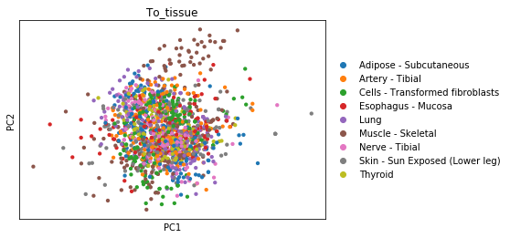
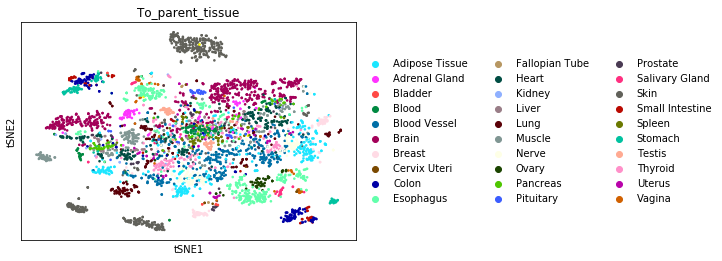
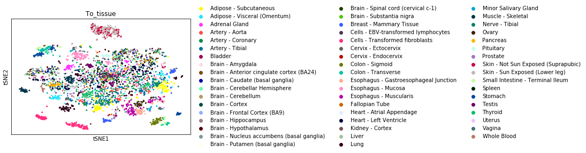
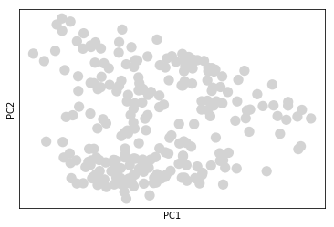
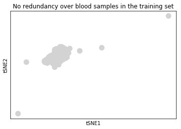
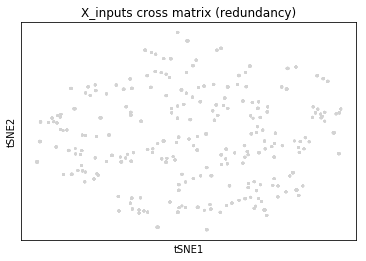

### Goal 

Compute the crossmatrix (X,Y) where x_ij_k - input and y_ij_l - target, for individual i, individual j, and tissues k,l where k <> l 

### TODO

1. Compute cross matrix
2. Visualize targets by tissue 
3. PCA over features, with n_components=50

### Conclusions
1. These will be stored under `/s/project/rep/processed/gtex/input_data/` as `X_inputs.h5`, `Y_targets.h5` containing:
    - relative expression changes with respect to the mean X_inputs.X, Y_targets.X
    - samples metadata, i.e. X_inputs.samples, Y_targets.samples, where the `Type` column stands for `train, valid, test`
    - features (genes) metadata, i.e. X_inputs.genes, Y_targets.genes

2. We do observe that for the following tissues we should have good predictions: Cells - Transformed fibroblasts, Skin, Muscle, Esophagus/Stomach/Colon.

3. Redundancy affects very heavily the PCA if we use the large crossmatrix as input for the PCA. Instead we will do the PCA over the non-redundant set.


```python
import os
import sys

import pandas as pd
import numpy as np
import matplotlib.pyplot as plt
from scipy import stats
import seaborn as sns
import h5py
import anndata

from rep import preprocessing_new as p

import plotly
import plotly.plotly as py
from plotly.graph_objs import graph_objs

# set credentials
plotly.tools.set_credentials_file(username='gium', api_key='nUFs5UnmuBR3pEbGIMj8')

import warnings; warnings.simplefilter('ignore')
```

    /opt/modules/i12g/anaconda/3-5.0.1/envs/rep/lib/python3.6/importlib/_bootstrap.py:219: RuntimeWarning: numpy.dtype size changed, may indicate binary incompatibility. Expected 96, got 88
      return f(*args, **kwds)


### 1. Compute cross matrix


```python
file = os.path.join(os.readlink(os.path.join("..","..","data")),"processed","gtex","recount","recount_gtex_logratios.h5ad")
gtex = p.load(file).transpose()
gtex = p.RepAnnData(X=gtex.X,samples_obs=gtex.obs,genes_var=gtex.var)

# load invidivudals
path = os.path.join("..","..","data","processed","gtex","recount")
train, valid, test = [], [], []
states = ['train','valid','test']
dict_states_indiv = {'train':train,'valid':valid,'test':test}

for s in states:
    with open(os.path.join(path,s+"_individuals.txt"), 'r') as f:
        for l in f: dict_states_indiv[s].append(l.replace("\n",""))


selected_genes = gtex.genes_names # training with all features
print("Total Genes: ",len(selected_genes))

```

    Total Genes:  19932


```python
%time (X_inputs, Y_targets) =  p.rnaseq_train_valid_test(gtex,dict_states_indiv,selected_genes,onlyBlood=True)
# save inputs and targets
path = os.path.join("..","..","data","processed","gtex","input_data")
X_inputs.save(os.path.join(path,'X_inputs_pc_onlyblood.h5'))
Y_targets.save(os.path.join(path,'Y_targets_pc_onlyblood.h5'))
```

    compute all arrangements
    Total pairs: 4403
    compute all arrangements
    Total pairs: 1630
    compute all arrangements
    Total pairs: 1558


```python
%time (X_inputs, Y_targets) =  p.rnaseq_train_valid_test(gtex,dict_states_indiv,selected_genes,onlyBlood=False)
# save inputs and targets
path = os.path.join("..","..","data","processed","gtex","input_data")
X_inputs.save(os.path.join(path,'X_inputs_pc.h5'))
Y_targets.save(os.path.join(path,'Y_targets_pc.h5'))
```

    compute all arrangements
    Total pairs: 105778


### 2. Visualize targets by tissue 


```python
import scanpy.api as sc
sc.logging.print_versions()
```

    scanpy==1.3.7 anndata==0.6.16 numpy==1.15.0 scipy==1.1.0 pandas==0.23.4 scikit-learn==0.20.0 statsmodels==0.9.0 python-igraph==0.7.1 louvain==0.6.1 


```python
top_tissues = ['Muscle - Skeletal','Skin - Sun Exposed (Lower leg)', 'Adipose - Subcutaneous','Lung', 'Artery - Tibial','Thyroid','Nerve - Tibial','Esophagus - Mucosa','Cells - Transformed fibroblasts']

file = os.path.join(os.readlink(os.path.join("..","..","data")),"processed","gtex","input_data","X_inputs_pc_onlyblood.h5")
inputs = p.RepAnnData.read_h5ad(file)

file = os.path.join(os.readlink(os.path.join("..","..","data")),"processed","gtex","input_data","Y_targets_pc_onlyblood.h5")
targets = p.RepAnnData.read_h5ad(file)

# subset train data
X_train_inputs = inputs[inputs.samples['Type'] == 'train']
Y_train_targets = targets[targets.samples['Type'] == 'train']
```


```python
train_individuals = X_train_inputs.obs['Individual'].tolist()
```

#### 2.1 What are we trying to predict?


```python
# plot what we are trying to predict
Y_train_targets_toptissue = sc.tl.pca(Y_train_targets[Y_train_targets.obs['To_tissue'].isin(top_tissues) ], copy=True)
```


```python
# sc.pl.pca_scatter(Y_train_targets_toptissue, color='To_tissue',components=['1,2','2,3','3,4'])
sc.pl.pca_scatter(Y_train_targets_toptissue, color='To_tissue',components=['1,2'])
```





```python
sc.tl.tsne(Y_train_targets_toptissue)
sc.pl.tsne(Y_train_targets_toptissue, color='To_tissue')
```

    WARNING: Consider installing the package MulticoreTSNE (https://github.com/DmitryUlyanov/Multicore-TSNE). Even for n_jobs=1 this speeds up the computation considerably and might yield better converged results.


```python
Y_train_targets =  sc.tl.pca(Y_train_targets, copy=True)
sc.pl.pca_scatter(Y_train_targets, color='To_tissue',components=['1,2'])
```


```python
sc.tl.tsne(Y_train_targets)
sc.pl.tsne(Y_train_targets, color='To_parent_tissue')
```

    WARNING: Consider installing the package MulticoreTSNE (https://github.com/DmitryUlyanov/Multicore-TSNE). Even for n_jobs=1 this speeds up the computation considerably and might yield better converged results.





```python
sc.pl.tsne(Y_train_targets, color='To_tissue')
```





### 3. PCA over features, with n_components=50


```python
file = os.path.join(os.readlink(os.path.join("..","..","data")),"processed","gtex","recount","recount_gtex_logratios.h5ad")
gtex = p.load(file).transpose()
gtex_filtered = gtex[gtex.obs['Individual'].isin(train_individuals)]
gtex_blood = gtex_filtered[gtex_filtered.obs['Tissue'] == 'Whole Blood']
```


```python
sc.tl.pca(gtex_blood)
sc.pl.pca_scatter(gtex_blood,components=['1,2'])
sc.tl.tsne(gtex_blood)
sc.pl.tsne(gtex_blood)
```





    WARNING: Consider installing the package MulticoreTSNE (https://github.com/DmitryUlyanov/Multicore-TSNE). Even for n_jobs=1 this speeds up the computation considerably and might yield better converged results.


```python
sc.tl.tsne(gtex_blood)
sc.pl.tsne(gtex_blood, title="No redundancy over blood samples in the training set")

sc.tl.tsne(X_train_inputs)
sc.pl.tsne(X_train_inputs,title = "X_inputs cross matrix (redundancy)")
```

    WARNING: Consider installing the package MulticoreTSNE (https://github.com/DmitryUlyanov/Multicore-TSNE). Even for n_jobs=1 this speeds up the computation considerably and might yield better converged results.





    WARNING: Consider installing the package MulticoreTSNE (https://github.com/DmitryUlyanov/Multicore-TSNE). Even for n_jobs=1 this speeds up the computation considerably and might yield better converged results.





OLD - calling


```python
def cross(norm_gtex):
    # load invidivudals
    path = os.path.join("..","..","data","processed","gtex","recount")

    train = []
    valid = []
    test = []
    states = ['train','valid','test']
    dict_states_indiv = {'train':train,'valid':valid,'test':test}

    for s in states:
        with open(os.path.join(path,s+"_individuals.txt"), 'r') as f:
            for l in f: dict_states_indiv[s].append(l.replace("\n",""))


    selected_genes = norm_gtex.obs_names # training with all features
    print("Total Genes: ",len(selected_genes))

    # compute cross tissue matrix
    (X_train_norm, Y_train_norm, samples_description_train, gene_id_train, metadata_train) = p.rnaseq_cross_tissue(norm_gtex, individuals=train, gene_ids=selected_genes, onlyBlood = True)
    (X_valid_norm, Y_valid_norm, samples_description_valid, gene_id_valid, metadata_valid) = p.rnaseq_cross_tissue(norm_gtex, individuals=valid, gene_ids=selected_genes, onlyBlood = True)
    (X_test_norm, Y_test_norm, samples_description_test, gene_id_test, metadata_test) = p.rnaseq_cross_tissue(norm_gtex, individuals=test, gene_ids=selected_genes, onlyBlood = True)
    
    return  (X_train_norm, Y_train_norm, samples_description_train, gene_id_train, metadata_train), (X_valid_norm, Y_valid_norm, samples_description_valid, gene_id_valid, metadata_valid), (X_test_norm, Y_test_norm, samples_description_test, gene_id_test, metadata_test)
```


```python
file = os.path.join(os.readlink(os.path.join("..","..","data")),"processed","gtex","recount","recount_gtex_logratios.h5ad")
gtex = p.load(file)
(X_train, Y_train, samples_description_train, gene_id_train, metadata_train), (X_valid, Y_valid, samples_description_valid, gene_id_valid, metadata_valid), (X_test, Y_test, samples_description_test, gene_id_test, metadata_test) = cross(gtex)
```

    Total Genes:  19932
    compute all arrangements
    Total pairs: 4403
    compute all arrangements
    Total pairs: 1630
    compute all arrangements
    Total pairs: 1558


```python
# save
path = os.path.join(os.readlink(os.path.join("..","..","data")),"processed","gtex","input_data")

p.writeh5(X_train,"X_train",os.path.join(path,"X_train_pc_bloodonly.h5"))
p.writeh5(Y_train,"Y_train",os.path.join(path,"Y_train_pc_bloodonly.h5"))
p.writeh5(X_valid,"X_valid",os.path.join(path,"X_valid_pc_bloodonly.h5"))
p.writeh5(Y_valid,"Y_valid",os.path.join(path,"Y_valid_pc_bloodonly.h5"))
p.writeh5(X_test,"X_test",os.path.join(path,"X_test_pc_bloodonly.h5"))
p.writeh5(Y_test,"Y_test",os.path.join(path,"Y_test_pc_bloodonly.h5"))

p.writeJSON(metadata_train,os.path.join(path,"XY_metadata_train_pc_bloodonly.json"))
p.writeJSON(metadata_valid,os.path.join(path,"XY_metadata_valid_pc_bloodonly.json"))
p.writeJSON(metadata_test,os.path.join(path,"XY_metadata_test_pc_bloodonly.json"))
```


```python
dict = {}
dict['train'] = {'samples':samples_description_train,'genes':gene_id_train.tolist()}
dict['valid'] = {'samples':samples_description_valid,'genes':gene_id_valid.tolist()}
dict['test'] = {'samples':samples_description_test,'genes':gene_id_test.tolist()}
p.writeJSON(dict,os.path.join(path,'metadata.json'))
```
